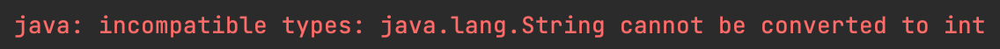

我是一位Java工程師，在第一份工作中主要是負責  
1.  SpringBoot配合MyBatis、Hibernate等ORM後端框架開發API。並且在系統內呼叫其他系統之API、Web Service。  
2. 前端使用VueJS開發，使用ajax、promise呼叫後端API。  
3. Ap Server基礎設定(JBoss, Undertow)。

而這次在找工作，除了希望能夠找到能延續相關技能的職缺外，也有特別找尋工作內容中能夠接觸到自己最近想要學習的技術，如: Cloud、Container、CI/CD...等。

前後花了兩個月左右面試，就用幾篇文章把還記得被問到的問題記錄下來，順便複習自己相關知識。

  
Image Source : [軟體工程師面試7大技巧](https://iter01.com/2624.html).

<!--truncate-->


## 程式相關

### 直譯語言 vs 編譯語言 
`直譯語言`會在執行的時候才一行一行的轉換、執行。因此速度較慢。

相反的，`編譯語言`會事先透過編譯器將程式編譯成machine code後再執行。因此執行時速度較快。


### 強型別 vs 弱型別
**`強型別語言`** 使用不同類別之間的操作必須正確、清楚。並且編譯時編譯器會報錯，因此避免了執行時期大部分非預期型別轉換的Error。 

```
// 以Java為例:  
int moneyPerDay = 100 + "200";
```  
編譯時會得到如下的錯誤  
    
> 強型別的嚴謹為我們減少 Runtime 的錯誤機會，但相對地開發時起來也會受到一定的制約、降低開發速度。

**`弱型別語言`** 不需要定義類別，會自動根據值來判斷當下的型別。可以直接將型別做更換，無須考慮原本型別。

~~~
// 以JavaScript為例:  
let moneyPerDay = 100;
moneyPerDay = "none";
~~~

是不會有任何問題的。

> 弱型別為了自由以及方便犧牲了嚴謹，導致正確性下降。

### Call By Value vs Call By Reference

`Call-By-Value` 傳遞參數時，將其值直接傳遞。因此更改參數的值並不會影響傳入的變數值。  

`Call-By-Reference` 傳遞參數時，傳遞的是參數在記憶體的'位址'。因此原本的物件和參數的位址是相同的，因此修改其值會改變原本物件值。


Java不允許我們自己處理記憶體位址。原生型別的變數如 `String`、`Integer`...等以及物件皆是*傳遞變數所儲存的值*。
其中，傳遞物件的時候，Java會幫我們建立一個欲傳遞的參數物件 (reference)的 copy 並且使用該 copy 傳遞。 只是剛好這個 copy 跟 reference 都指向記憶體裡面相同的位址而已。

因此執行以下傳遞原生型別參數的Java程式時，Console會印出變數`temperatureNow`值為30。

~~~
public static void main(String ...args){
	int temperatureNow = 30;
	addFiveDegree(temperatureNow);
	System.out.println(temperatureNow);
}

public static void addFiveDegree(int temperature){
	temperature += 5; 
}
~~~  

而當執行以下傳遞非原生型別參數的Java程式時，傳遞的是位址。因為一樣是`Call By Value`的關西，因此無法更改傳入物件之記憶體位址(符合前面之定義)，但能夠更改該記憶體位址上的內容。

~~~  
public static void main(String ...args){
	Home myHome = new Home("Taoyuan", "0317");
	changeInfoOfHome(myHome);
	System.out.println(myHome.address); // will print Taoyuan
	System.out.println(myHome.telephone); // will print 123
}

public static void changeInfoOfHome(Home home){
	home.telephone = "123";
	home = new Home("Taipei", "0976");
	System.out.println("Address inside function : " + home.address); // will print Taipei
	System.out.println("Telephone inside function : " + home.telephone); // will print 0976
}

public static class Home {
	String address;
	String telephone;

	public Home(String address, String telephone) {
		this.address = address;
		this.telephone = telephone;
	}
}
~~~

### 物件導向程式特點
* 封裝 Encapsulation  
	將對象的屬性(attributes)和行為(methods)保存在一個地方，並且提供Access Modifiers(`public`、`protected`...等)決定開放給外在環境的程度高低，達到**隱藏使用者不需要的細節**之目的。
* 抽象 Abstract  
	把許多物件擁有之同一概念、屬性從類別中抽離出來。只**關注在類別的特點上而不關注實現的細節**。
* 繼承 Inheritance  
	透過繼承，達到**程式復用**。子類別繼承父類別所有屬性、函數。
* 多型 Polymorphism  
	發生在有繼承之物件。子類別Override父類別之實作內容，達到**同一動作但不同實作方式**。
	
	:::tip 延伸  
	更多關於多型可參考此[網站](https://www.mygreatlearning.com/blog/polymorphism-in-java/)  
	:::


### MVC 是什麼  

Model-View-Controller的軟體架構。

`Model(模型)`  
和資料有關的一切。 但不知道自己會被如何使用。  
`View(視圖)`  
 和UI邏輯有關的一切。負責顯示Model給使用者。  
`Controller(控制器)`  
Model和View之間的橋樑，接收操作並且決定對應要做的動作。

使用此架構的幾個優點有:  
1. 讓不同層面的區塊彼此獨立，當其中某個區塊需要改變時，不會影響到其他區塊。增加了系統的**穩定性**、**可測試性**。  
2. **同一model可以被不同view使用**，例如: 提供手機、電腦同一頁面，其背後使用的資料(model)都是一樣，只是顯示方式不同。  
3. 可以讓開發過程中，各工程師負責不同區塊，**提升開發效率**。

## 延伸閱讀

1. [Difference Between Compiler and Interpreter with respect to JVM (Java virtual machine) and PVM (Python virtual machine)](https://rahul-saini.medium.com/difference-between-compiler-and-interpreter-with-respect-to-jvm-java-virtual-machine-and-pvm-22fc77ae0eb7)  
2. [Java Heap Space vs Stack – Memory Allocation in Java](https://www.journaldev.com/4098/java-heap-space-vs-stack-memory)
3. [stack vs heap：執行時期儲存兩大要角](https://antrash.pixnet.net/blog/post/70456505)

## 參考網址

1. [編譯語言 VS 直譯語言](https://totoroliu.medium.com/編譯語言-vs-直譯語言-5f34e6bae051)
2. [Difference Between Compiler and Interpreter with respect to JVM (Java virtual machine) and PVM (Python virtual machine)](https://rahul-saini.medium.com/difference-between-compiler-and-interpreter-with-respect-to-jvm-java-virtual-machine-and-pvm-22fc77ae0eb7)
3. [Pass by Value and Pass by Reference in Java for Method Parameters](https://cs-fundamentals.com/java-programming/java-call-by-value-call-by-reference.php)
4. [Polymorphism in Java – An Introduction](https://www.mygreatlearning.com/blog/polymorphism-in-java/)
5. [Six Benefits Of Using MVC Model For Effective Web Application Development](https://www.brainvire.com/six-benefits-of-using-mvc-model-for-effective-web-application-development/)


