今天打算記錄一下如何在 Aws 上建立 EC2 Instance 並且架設 Apache Web Server。然後，我們將設定 SSL 使得我們可以透過 Https 連線到 Web Server 上。 另外也會順便放置檔案使得我們可以用此 Web Server 放置並且下載 app 檔案 (ios -> ipa, android -> apk)

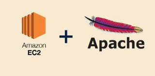  
Image Source : [A Newbie’s Guide To Creating An EC2 Instance With An Apache Server Via The AWS CLI](https://blog.devgenius.io/a-newbies-guide-to-creating-an-ec2-instance-with-an-apache-server-via-the-aws-cli-5bdfc8aaae53).

<!--truncate-->


## 在 Aws 啟動一個 EC2 Instance 

  1. 先申請一個 Aws 帳號 (如果已經擁有帳號，可跳過)  
    AWS 提供新帳戶12個月免費，並且提供如 750 小時/每月的 EC2 使用時數...等，詳細免費用量可參考 [AWS 免費安案說明][aws_free_tier]
  
  2. 我的帳戶 -> 進入 AWS 管理主控台 <br>
    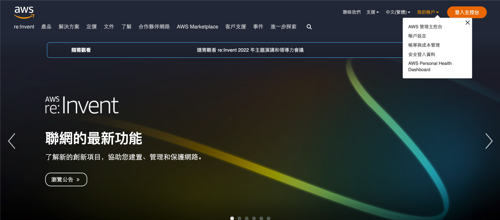  

  3. 進入 EC2 儀表板
    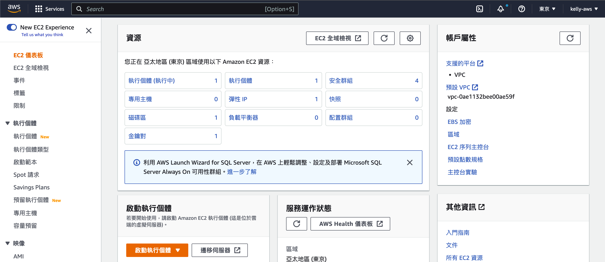  
  
  4. 從左側列表中選取「執行個體」，選擇右上角之「啟動新執行個體」按鈕。
    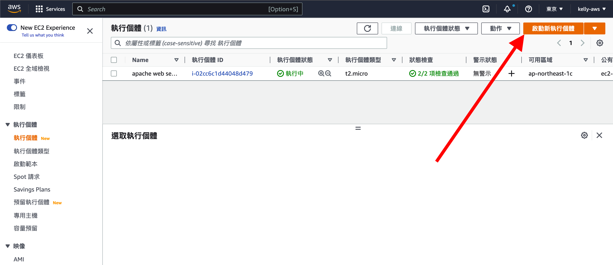  

  5. 給予此 EC2 Instance 一個名稱，我們取名為 EC2 with Apache Web Server (名稱沒有限制，可自行命名)
    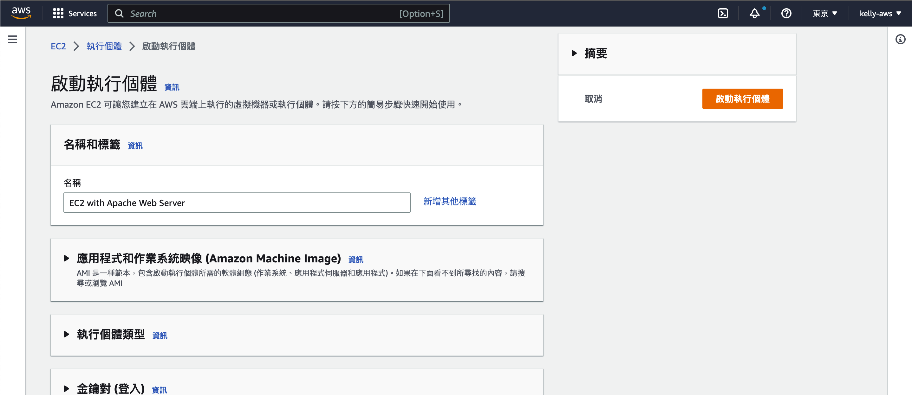 

  6. 應用程式和作業作業系統映像檔案 (可依照自己喜好選擇其他作業系統無仿。但後續步驟可能會有些微差異)
     * 收尋 Ubuntu 映像檔案  
      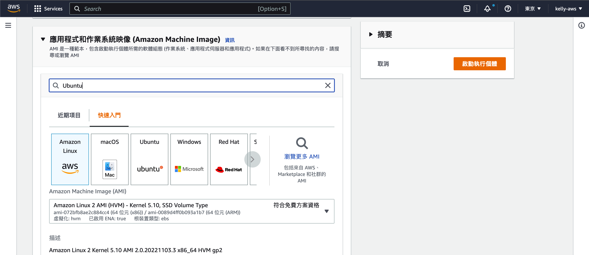  
      * 選擇使用 Ubuntu Server 22.04 LTS 
      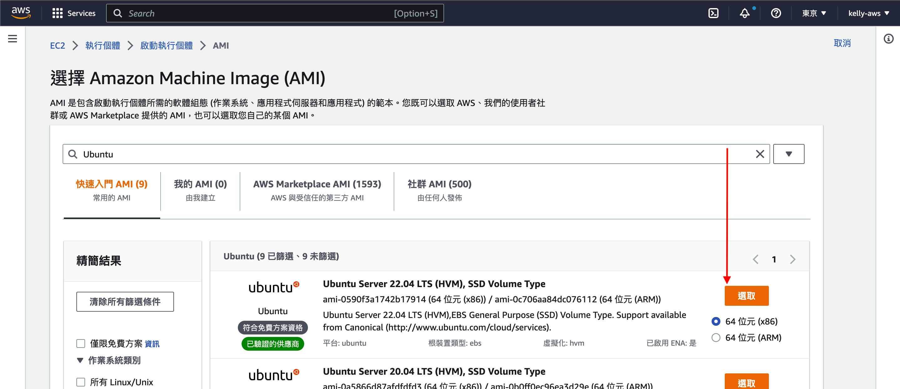  

  7. 執行個體類型，選擇使用 t2.micro (預設應該即是此類型)  
    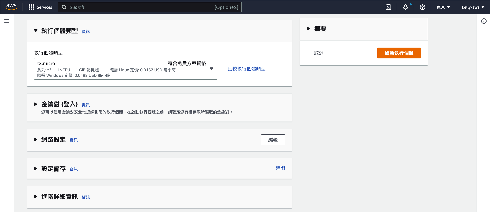 

  8. 建立新的金鑰對，給予一個喜愛的名稱，類型選擇 RSA，私有金鑰檔案格式選擇 .pem。  
    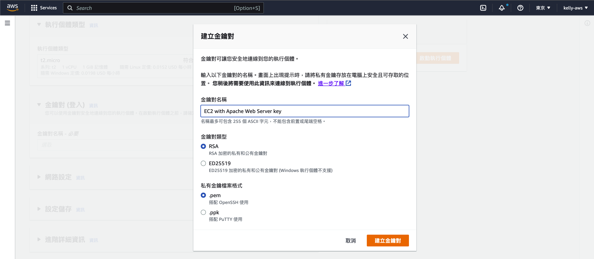  
    建立金鑰對之後，瀏覽器會自動下載一個 pem 檔案，稍後將會使用來讓我們能夠 SSH 進入 EC2 Instance 當中。

  9. 網路設定，建立一個新的安全群組。  
     (因為這裡是展示用，我們將所有能夠允許之選項皆勾選。實際使用時，請依照所部署之環境以及資源安全考量設定安全群組之規則提升安全性。)  
    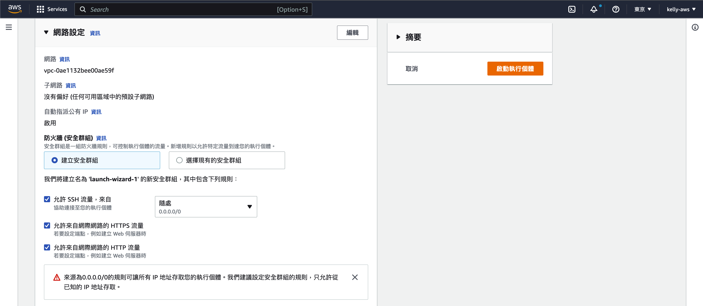  

  10. 點擊「啟動執行個體」，完成後，將會看到如下圖之畫面。點擊箭頭處查看詳細資訊。  
    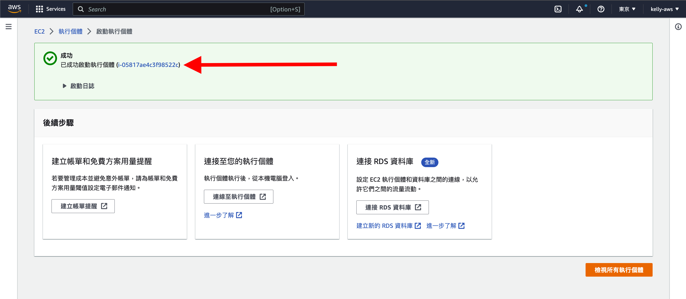  
    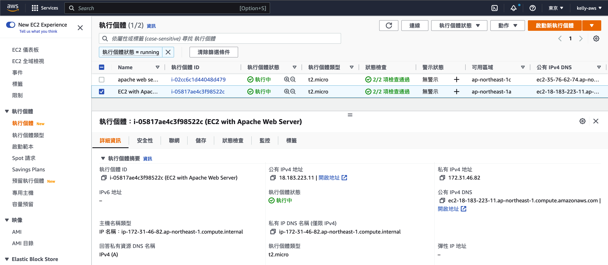  
    

## SSH 進入 Aws Instance 

  到這邊我們已經成功啟動一個 Aws EC2 Instance了，接著我們可以試著 SSH 進入 Instance。

  在建立金鑰對之後，瀏覽器為我們下載了一個 .pem 檔案。<br>
  我們先開啟 Command Line 並且 cd 到 .pem 檔案所在之目錄下。

  這邊我先將我本機的 .pem 檔案命名為 ec2-apache-web-server.pem。
  <br>
  並且從上面執行個體中的截圖可查看「公有IPv4地址」得知此 Instance 之 IP。
  因此，在 Command Line 中輸入<br>   ```ssh -i ec2-apache-web-server.pem ubuntu@18.183.223.11```

  這時候，Command Line之中可能會出現如下圖之訊息。
  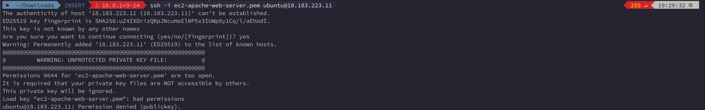  

  其中兩行訊息告訴了我們為何出現此錯誤訊息。<br>
  ```
  Permissions 0644 for 'ec2-apache-web-server.pem' are too open.
  It is required that your private key files are NOT accessible by others.
  ```
  原來是因為現在 .pem 檔案所擁有之權限太多了。因此我們只需要透過 chmod 將檔案權限更改成 600即可。<br>
  ```sudo chmod 600 ec2-apache-web-server.pem```  

  這時，再次嘗試執行 SSH 指令，應該即可正常進入到 Instance 之中了。
  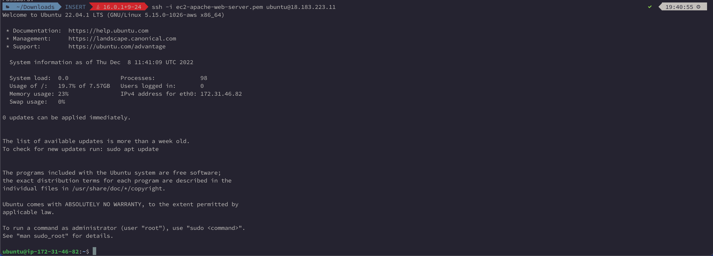  

## 為 EC2 申請一個固定 IP
  因為 EC2 在 Shut down 重啟之後，所被配置 IP 將會變動。因此我們需要為我們的 Instance 申請一個固定 IP。

  > **⚠️** 注意
  > 
  > 申請後，包括 SSH 以及瀏覽器輸入之 IP 請使用取得之固定 IP。

  於 AWS 管理主控台 左側列表中選擇'網路和安全'底下之「彈性IP」。 進入後選擇右上角之「配置彈性 IP 地址」按鈕。
  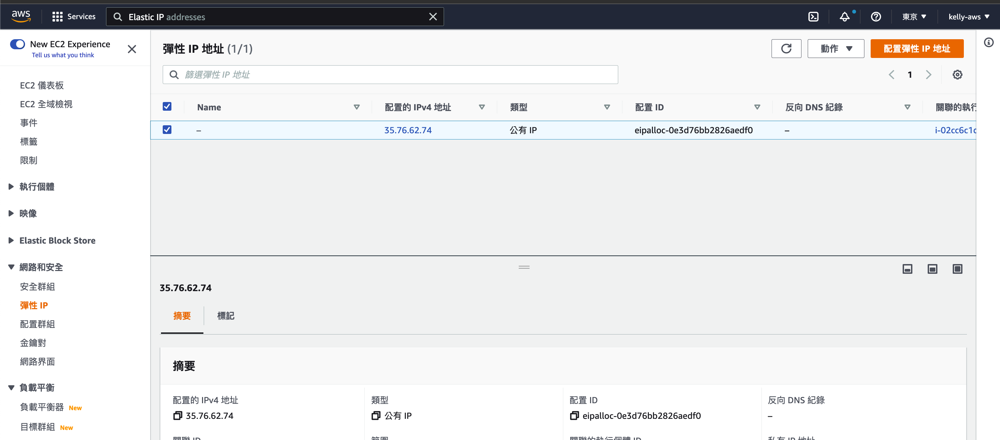 

  直接點擊「配置」按鈕
  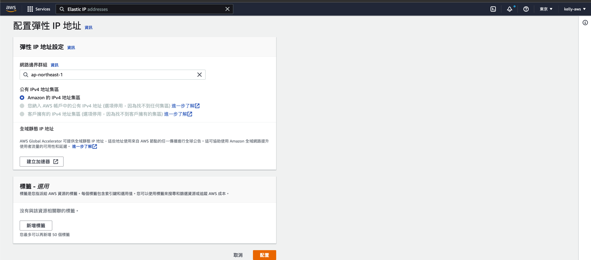 

  成功後，點擊「」「與此彈性 IP 地址建立關聯」按鈕  
  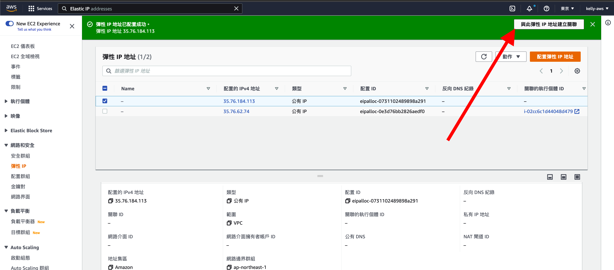 

  執行個體選取我們所建立之個體後，點擊「建立關聯」按鈕
  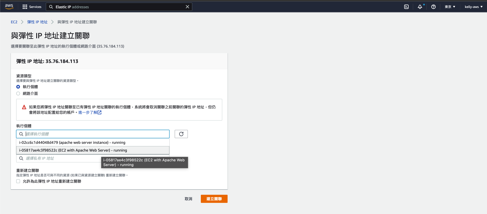 


## 架設 Apache Web Server
  * 在 EC2 Instance 之中執行以下指令
    ```
    # Update Packages
    sudo apt-get update

    # Install Apache2
    sudo apt-get install apache2

    # Check if apache is running 
    sudo systemctl status apache2
    ```
  * 瀏覽器輸入上步驟與我們 EC2 Instance 關聯之彈性 IP，查看 Apache 預設畫面
    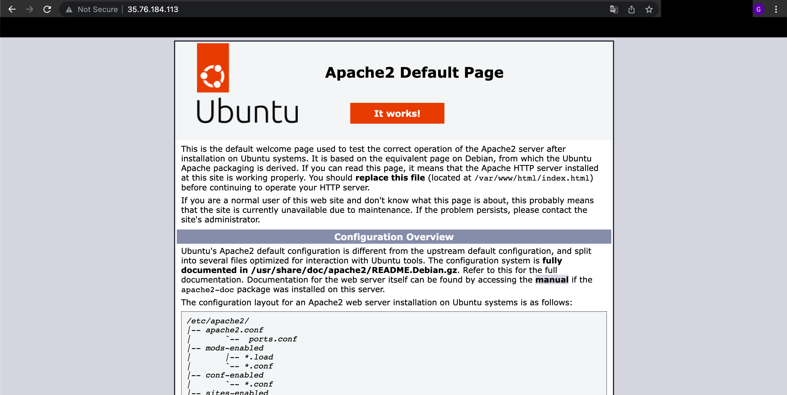  


## 使用 Domain Name 訪問我們的網頁

  1. 這邊我使用 [FreeNom][freenom_free_domain_name] 註冊免費的 Domain Name。註冊並且登入後，點擊右上角 Services -> Register a New Domain
   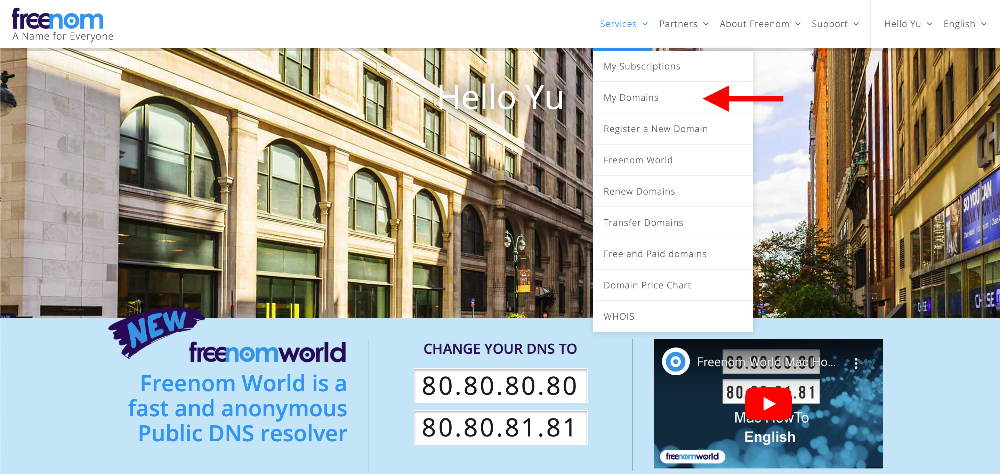  
   
  2. 輸入想要的 domain 名稱後選取一個免費的，這邊我們選擇 mycooldomain.ml  
   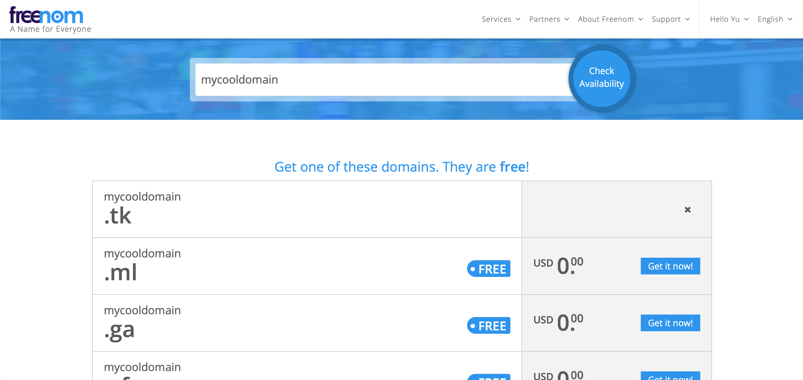  

  3. 點擊 CheckOut 之後，將看到以下畫面。<br>
   Use DNS 中 IP Address 輸入彈性 IP，Period 當然是選擇免費中最長之期限啦!   
  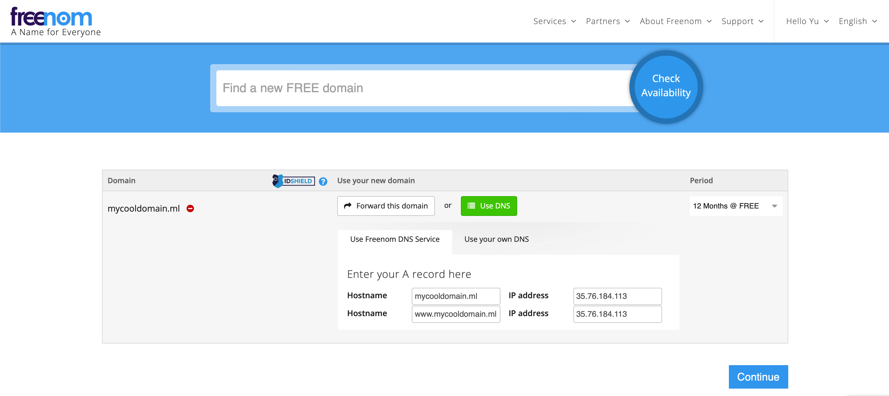  

  4. 持續點擊確認，完成後續步驟。 等待數分鐘後，應該即可於瀏覽器中使用 Domain Name 訪問我們EC2 instance上的Apache Web Server。  
  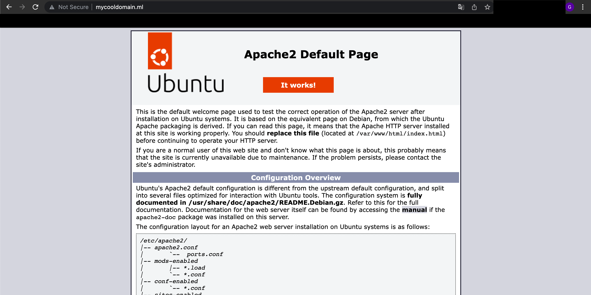  
  
## 設定 SSL，讓我們能夠使用 Https 訪問我們的網頁

  1. 在 EC2 Instance 上下載 OpenSSL <br>
    ```sudo apt-get install openssl```
  2. Enable SSL module for Apache<br>
    ```sudo a2enmod ssl```
  3. Restart Apache Web Server <br>
    ```sudo service apache2 restart```
  4. 產出 CSR (Certificate Signing Request)，將會用來輸入到 SSL 管理中心。  
      ```
      # 建立以下路徑
      sudo mkdir /etc/apache2/ssl
      sudo mkdir /etc/apache2/ssl/private

      # 進入此路徑底下
      cd /etc/apache2/ssl/

      # 在此路徑，產出 CSR 檔案以及我們的 Private Key (website.key)
      # 將會詢問 Country Name, State, Locality Name ... 等問題，照著輸入即可。可參考下面之附圖。
      sudo openssl req -new -newkey rsa:2048 -nodes -keyout website.key -out website.csr

      # 透過以下指令查看 website.csr。 將其內容複製
      sudo nano /etc/apache2/ssl/website.csr
      ```
      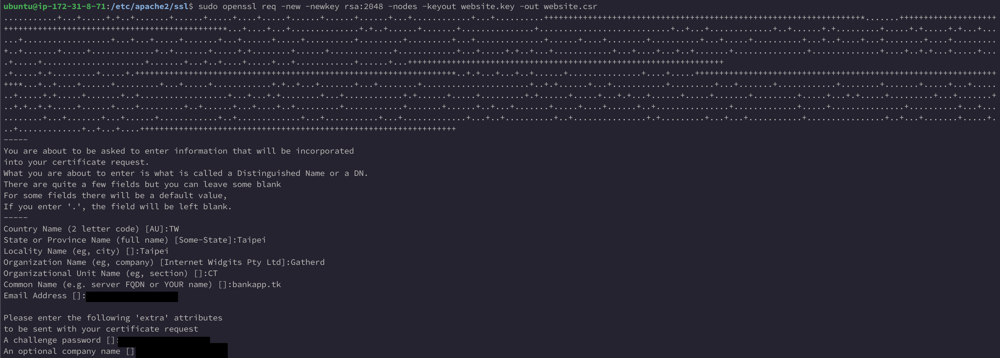  
  5. 這邊我使用 [zeroSsl][zeroSSl] 來取得 SSL Certificate。註冊帳號並且登入之後，選取 New Certificate 建立新憑證。
  6. 輸入我們在 freenom 取得之 Domain Name  
    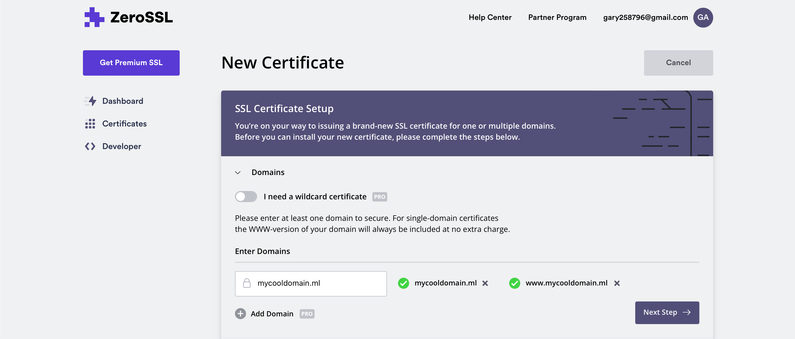  
  7. 選擇 90 天之效期 (因為免費只提供一次90天，因此要特別注意到期日)
    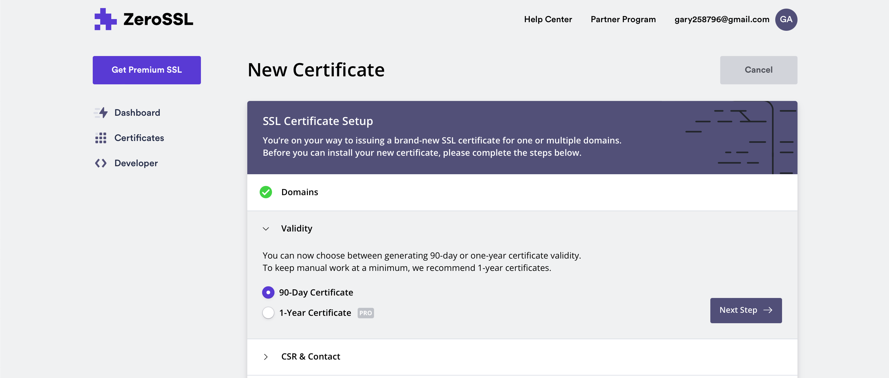  
  8. Disable Auto-Generate CSR，貼上剛剛複製出之我們自產的 CSR 檔案內容。  
    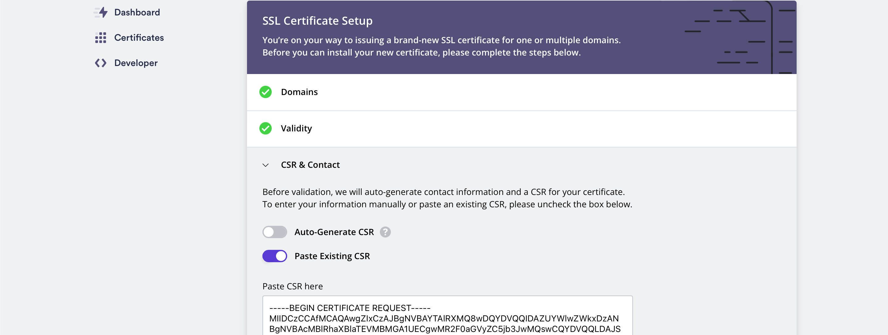  
  9. 選取免費方案
    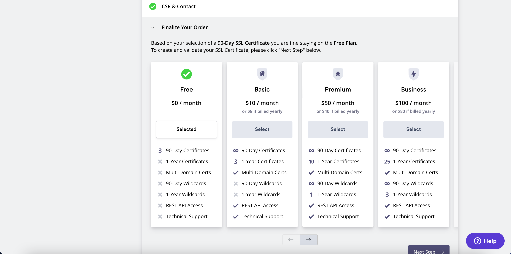  

  10. 驗證方式選擇 DNS (CNAME)
    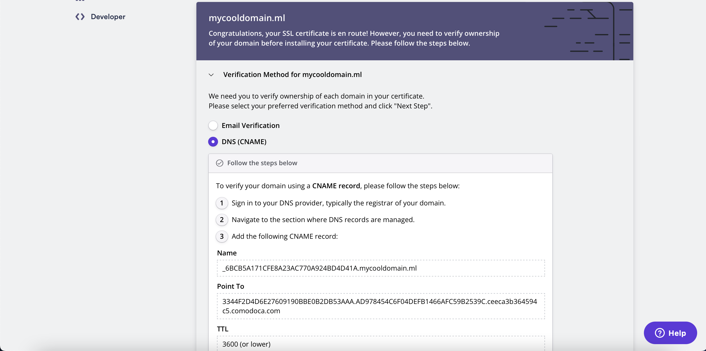  
  
  11. 回到 Domain Name Service 提供網站 - Freenom。  
    a. 從 My Domains 中選取我們加入之 Domain，點選 Manage Domain -> Manage Freenom DNS。  
    b. 新增一個 CNAME record，並依照上一步驟 zerossl 提供之資訊填入。      
      > **⚠️** 注意
      > Name中填入之值無需帶入 domain 之部分。
      > 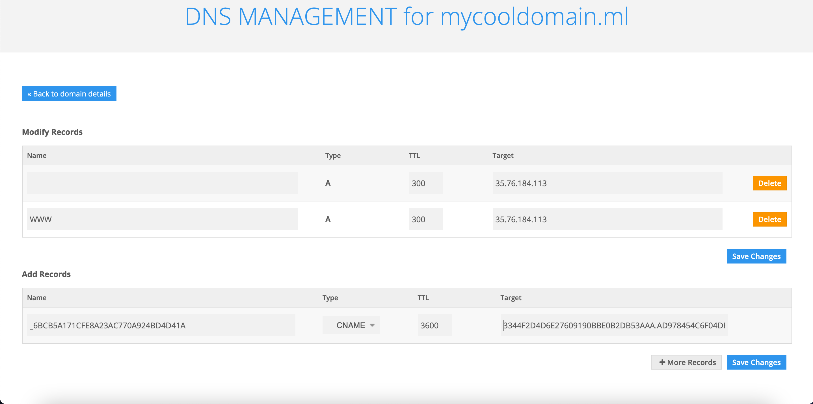  

  12. 新增完成後，回到 zeroSSL 網頁中繼續下一步驟， Verify Domain。  
    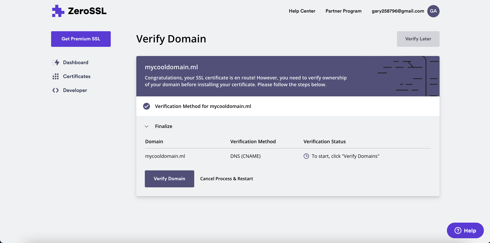 

  13. 驗證成功後(可能會需要一點時間)，zeroSSL即會提供下載 SSL 憑證之按鈕。
      > **⚠️** 注意
      > 下載的檔案中，包含了兩個 crt 檔案。但因為我們使用了自己產生的 CSR，因此不會有 private Key檔案。
      > 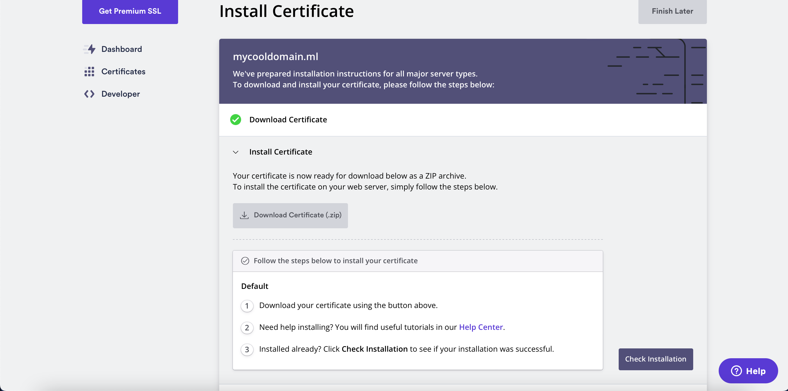  

  14. SFTP 進入 EC2，我使用 CyberDuck 作為我的工具。(如果上傳過程中發生 Permission Denied，請透過 chmod 指令將路徑權限打開)
    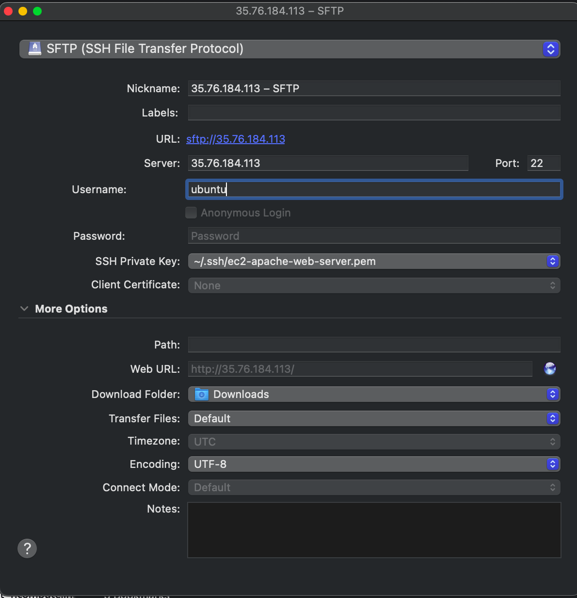

  15. 將下載檔案中的兩個 .crt 檔案上傳至路徑 /etc/ssl 底下
  16. 編輯 /etc/apache2/sites-available/default-ssl.conf檔案 <br>
      確認檔案之中有以下之內容
      ```
      ServerName mycooldomain.ml
      ServerAlias www.mycooldomain.ml
      DocumentRoot /var/www/html
      SSLEngine on
      SSLCertificateFile	/etc/ssl/certificate.crt
      SSLCertificateKeyFile /etc/apache2/ssl/website.key
      SSLCertificateChainFile /etc/ssl/ca_bundle.crt
      ```
  17. Activate SSL virtual Host <br>
    ```sudo a2ensite default-ssl.conf```

  18. 再確認一次 Apache Module: mod_ssl 已經下載過
    ```sudo a2enmod ssl```

  19. Restart Apache web server <br>
    ```sudo service apache2 restart```

## 修改 index.html 並下載 App

  完成以上步驟後，現在我們應該已經可以透過 https 連線到我們所拿到的 domain name 了！

  最後，我們將更改 index.html 的內容，讓我們能夠從網頁上下載 app (iOs, Android)。將網頁作為 App Store 來下載開發的 App。

  1. 編輯路徑 /var/www/html 下的 index.html 檔案，可參考 [index.html](./index.html)
  2. 將 ios ipa檔案，android apk檔案依照 index.html所設定之路徑放置好。
  3. 重啟 Apache Web Server 後，即可透過網頁下載 App。
    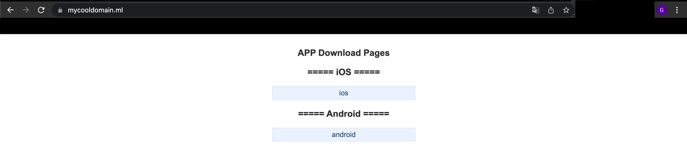
   
<br>

### 參考文章
1. [How to Set Up Apache Web Server in AWS EC2 Linux (Ubuntu) Instance](https://www.geeksforgeeks.org/how-to-set-up-apache-web-server-in-aws-ec2-linux-ubuntu-instance/)  
2. [Simplest way to Use our SSL Certificates with Amazon EC2 Ubuntu Server](https://www.domainsatretail.com/blog/security/simplest-way-use-ssl-certificates-amazon-ec2-ubuntu-server/)
3. [Installing SSL Certificate on Apache](https://help.zerossl.com/hc/en-us/articles/360058295854-Installing-SSL-Certificate-on-Apache)
4. [Generate-csr-with-openssl-on-ubuntu](http://edtechchris.com/2020/02/11/generate-csr-with-openssl-on-ubuntu/)
5. [ssl-certificate-install-aws-guide-apache-ubuntu](https://financetrainingcourse.com/education/2016/06/ssl-certificate-install-aws-guide-apache-ubuntu-14-04/)

<!-- 相關網站 -->
[aws_free_tier]: https://aws.amazon.com/tw/free/?all-free-tier.sort-by=item.additionalFields.SortRank&all-free-tier.sort-order=asc&awsf.Free%20Tier%20Types=*all&awsf.Free%20Tier%20Categories=*all "Aws 免費方案說明"

[freenom_free_domain_name]: https://my.freenom.com/clientarea.php "Freenom 免費 Domain Name 服務"

[zeroSSl]: https://app.zerossl.com/login?u=https%3A%2F%2Fapp.zerossl.com%2Fdashboard "ZeroSSl Ssl certificate"