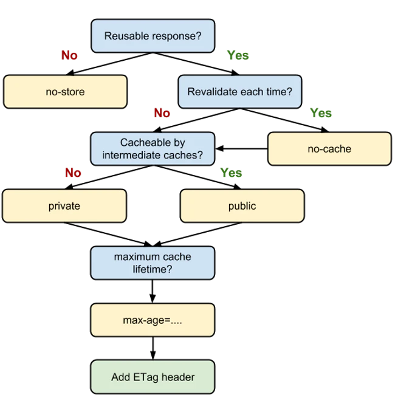
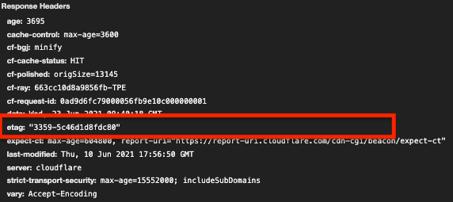
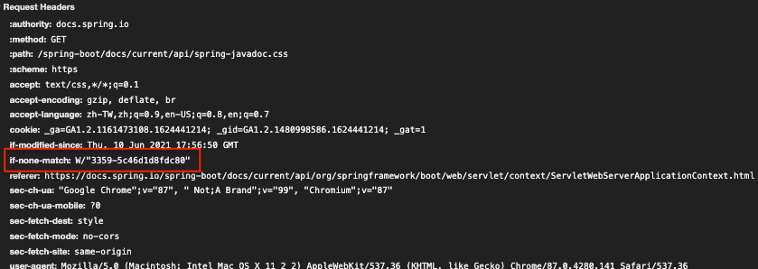
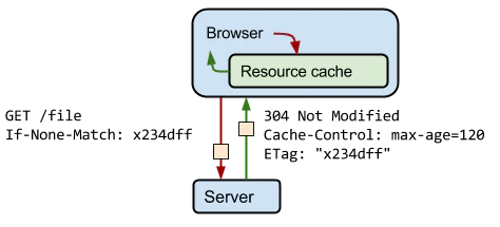

由於最近在面試找工作，才發現雖然自己身為網頁應用程式開發者，卻還沒有好好瞭解過http cache的方式、機制等等。  趁著這次機會，讓自己好好瞭解認識一下 Http Cache相關原理、機制。

Image Source : [Cache Control](https://imagekit.io/blog/content/images/2020/01/1440_800-cache-control.png).

<!--truncate-->

## 前言
身為一位網頁開發者，不論身處前端或者後端，知道如何讓整個網頁應用程式品質更高、使用者體驗更好絕對只有好處沒有壞處。  

而現今的各瀏覽器即便不特別設定，也會為我們選擇它認為的最好快取策略。可對於開發者，我們很大概率會需要自己掌控、制定快取機制。來讓我們的網頁擁有更好的服務品質。  

因此就讓我們就來認識看看Http Cache如何能夠幫助網頁提升效率，以及減少伺服器的負擔。

## Client 和 Server 溝通簡易流程

1. Client(瀏覽器)向Server送出請求某個資源，Ex: abc.css
2. Server 回傳abc.css並且透過ETag，Expires等資訊告訴瀏覽器請他可以保存該資源在快取。
3. 當再次需要索取abc.css時，瀏覽器會先跟快取確認，如果有就回傳給瀏覽器。
4. 快取上沒有合適的檔案時，則將請求發送給Server。

 以此達到**減少網路傳輸量**，**減少使用者等待時間**，**減輕伺服器負擔**以及**提升使用者體驗**。  

## 決定header

在決定使用什麼快取策略時，可以參考下面的流程圖。幫助我們由大方向到小方向決定使用哪些header和directives(指令)。

  
Image Source : [Guide for Caching and Http Cache Headers for Static Content] [1].

## 與 http cache相關之headers

在開始說明headers前必須要先說明一些東西。首先，快取『過期』或者『超過時間不新鮮』，英文為 **Stale**。  
再者，當快取為stale時，不代表失效、不能再被使用。此時會配合接下來提到的一些header資訊，如`ETag`、`Last-Modified`...等，幫助瀏覽器以及Server決定是否能夠繼續使用該快取或者重新發送一個。

--- 

*  `Expires`  
	* 指定一個時間點，資源在此時間點後會被當作 **stale**。  
	:::info  注意
 	根據 [Expires vs Max-Age][2] 以及 [Expires Headers for SEO][3]，在使用此Header必須多考慮幾個面向，避免反而因此造成對網站的負面影響，如: 因為將`Expires`時間設定為太長，導致某個資源在更新後，卻因而一直還在使用快取上的資源。但後來'**將版本號加入Url**'的方式能讓我們解決快取不常更新資源又同時能夠在更新時，立馬讓瀏覽器重新跟Server請求，因此在現在這個時間點似乎當時的問題也不再是問題。
	:::
* `Cache-Control` 
	*  提供許多Directives(指令)，可作不同設定。
	*  Directives:
		1. `public`、`private`  
			如快取被設定為private，則只能被單一使用者使用並且不能被共享快取(如: [CDN](https://zh.wikipedia.org/wiki/內容傳遞網路) )存取。  
			通常會存放與個人較相關之訊息。
		2. `no-store`  
			完全不快取該資源。
		3. `no-cache`  
			和名稱所感覺之意思不同。  
			實際上no-cache效果為讓瀏覽器每次使用資源之前，都必須跟Server驗證過後才能使用。  
			因此，可以使用 `must-revalidate` 來避免誤會且達到同樣效果。
		4. `max-age`  
			和 `Expires`指定失效時間不同， `max-age`指定資源剩下多少時間會被當作 **stale**。  
			:::tip 提示   
			   `max-age`的層級較Expires高，因此同時存在時會以`max-age`設定為優先。  
			:::  
* `ETags`  	 
	* 為**Strong-Validator**, 使用`ETag`驗證檔案可以完全確定資源是否一模一樣。
	* 為用來確定快取雖然狀態為stale，但能否繼續使用之header。
	* 伺服器會根據資源內容產生雜湊(Hash)值並放在Response Header裡。如:  
	   
	當再次對同一資源發出請求時，會將該值放在Request Header裡的 `if-none-match`一起送往Server。  
	 
	Server因而可以判斷Client端快取資源的版本是否與現在Server上資源版本相同，如相同則回傳`304 Not Modified`。 如圖 :    
	
	  
	Image Source : [Etag Flow][4].
* `Last-Modified`
	* 為**Weak-Validator**, 使用`Last-Modified`驗證時如果內容不變，footer或者如廣告變動了還是會被當作一樣的資源。而Strong-Validator則會視為不一樣的資源。
	* 為用來確定快取雖然狀態為stale，但能否繼續使用之header。
	* 和 `ETag`不同在於，`Last-Modified`並非以檔案內容來判定，而是以'時間'判定檔案是否有變動，也因此使得其為Weak-Validator。
	* 伺服器會將資源最後異動時間放在此Response Header中，接著當對同資源再出發出請求時，瀏覽器會在Request Header中加上`If-Modified-Since`，來讓伺服器可以以此和目前系統上該資源比較。  
	:::tip 提示   
	`If-Modified-Since`的限制為最小時間單位為秒。優先順為小於 `If-none-match`  
	:::  

## 結語
--- 
透過http cache提供的許多header，我們可以很好地達成各種需求所需的不同快取策略，提升網站的品質。想必從以前到現在強調使用者體驗的時代更是不可忽略的一塊。

快取的內容也遠不止如此，我想未來也會再找時間針對其他部分繼續深入學習！

  
### 推薦閱讀

1. [HTTP Caching | Summer。桑莫。夏天](https://cythilya.github.io/2018/07/27/http-caching/)  
2. [from memory cache與from disk cache詳解](https://www.itread01.com/content/1544784485.html)
  
### 參考文章
1. [Guide for Caching and Http Cache Headers for Static Content](https://imagekit.io/blog/ultimate-guide-to-http-caching-for-static-assets/)  
2.  [Expires vs. max-age](https://www.mnot.net/blog/2007/05/15/expires_max-age)  
3.  [Expires Headers for SEO](https://moz.com/blog/expires-headers-for-seo-why-you-should-think-twice-before-using-them)  
4.  [Http Caching](https://developer.mozilla.org/en-US/docs/Web/HTTP/Caching)
5.  [HTTP conditional requests](https://developer.mozilla.org/en-US/docs/Web/HTTP/Conditional_requests)
6. [Prevent unnecessary network requests with the HTTP Cache](https://web.dev/http-cache/)

[1]: <https://web.dev/http-cache/#flowchart> "Flow Chart"
[2]: <https://www.mnot.net/blog/2007/05/15/expires_max-age> "Expires vs Max-Age"
[3]: <https://moz.com/blog/expires-headers-for-seo-why-you-should-think-twice-before-using-them> "Expires Header for SEO"
[4]: <https://web-dev.imgix.net/image/tcFciHGuF3MxnTr1y5ue01OGLBn2/e2bN6glWoVbWIcwUF1uh.png?auto=format&w=500> "ETag flow"
[5]: <https://imagekit.io/blog/content/images/2020/01/1440_800-cache-control.png> "Cover Image"