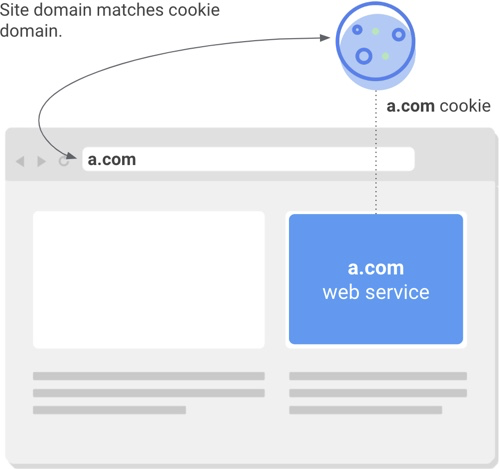
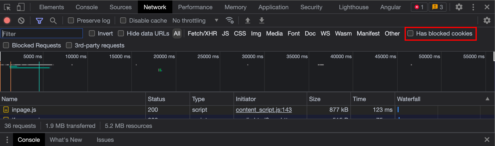

近日因為客戶端為了配合 Google 今年十一月以後上架之 app 需使用 Android Sdk 31 以上而開始會遇到一些問題。  
在這其中，即有升級後發現 app 因無法取得原本存放在 cookie 中的資料導致無法正常啟動。
就讓我們一起來看看是什麼原因導致的吧！

  
Image Source : [get-ready-for-new-samesitenone-secure](https://lh3.googleusercontent.com/AgtxHofbBpva_NgsyGLvLko9J6ZFgWBDk3zqFXz37zWCuokA0xfCciKug5A3-ze7FGlorSWfVoPnwiWC7ydHjkqePG4g09SNQE37eXZfj3oz7buWcTrUMgF6QvdDX__9ks3HJap_).

<!--truncate-->

## 跨網站 vs 同網站

**同網站** -> cookie 之 domain 與當下網址列中網址 domain 相同。  
**跨網站** -> cookie 之 domain 與當下網址列中網址不同。

## Samesite

SameSite 屬性是 Http response header : **Set-Cookie** 的屬性。  透過此一屬性控制 Cookie 被限制在同 domain 之程度。

> 根據 [android developer - Modern SameSite cookies in WebView](https://developer.android.com/about/versions/12/behavior-changes-12#samesite)  
> Starting in Android 12, these changes are also included in WebView when apps target Android 12 (API level 31) or higher.

在 Android 12 開始，開發者需要依照需求設定 cookie 之 samesite 政策。 Samesite 提供三種值給我們設定。

1. Strict : 只允許 Cookie 被帶入同網域之請求之中。  
2. Lax(Default) : 只允許 Cookie 被帶入同網域之請求之中，以及像是從其他網站使用 \<link\> 訪問和 Cookie 同 domain 之網址時。
3. None : 允許所有同網域、跨網域之請求。必須搭配 Secure 屬性一同使用。

## 透過 Chrome 查看網站 Cookie 是否有被 SameSite 影響

從 Chrome 的開發人員工具之中 -> 網路(Network)  
將 Has Blocked Cookies 選項打勾後，所有因為 SameSite 屬性而未被發送之 Cookies 都會被列在這邊。   

   

如果使用的 Chrome 還未嚴格要求使用 SameSite 屬性，會透過 Warning 的方式提醒我們。

### 參考文章
1. [Samesite-cookies-explained](https://web.dev/samesite-cookies-explained/)  
2. [behavior-changes-12](https://developer.android.com/about/versions/12/behavior-changes-12#samesite)  
3. [get-ready-for-new-samesitenone-secure](https://developers.google.com/search/blog/2020/01/get-ready-for-new-samesitenone-secure)  
