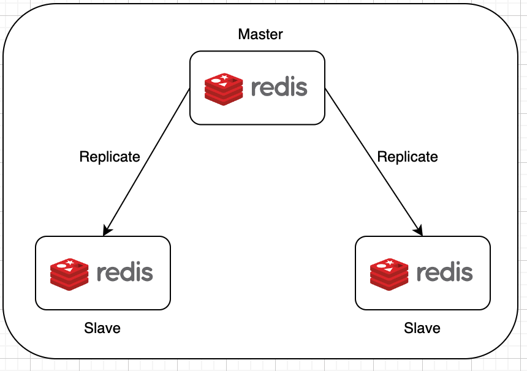
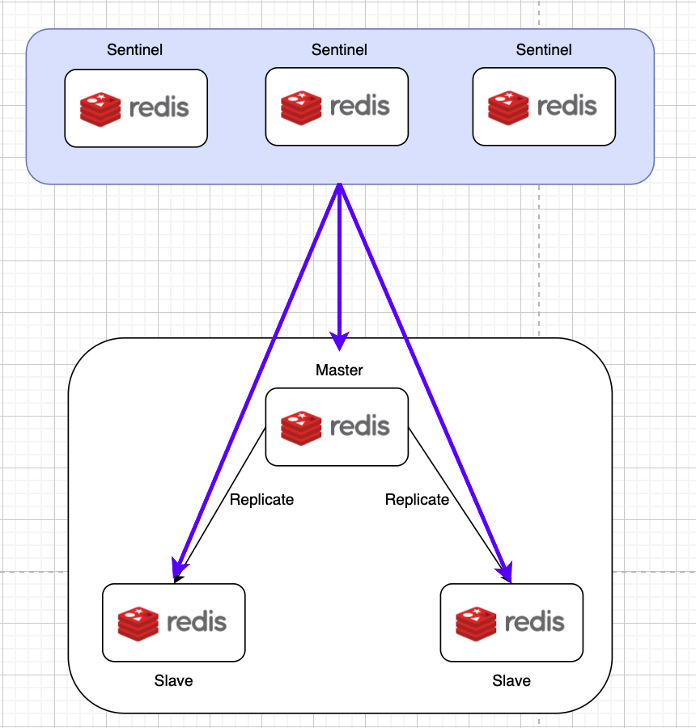
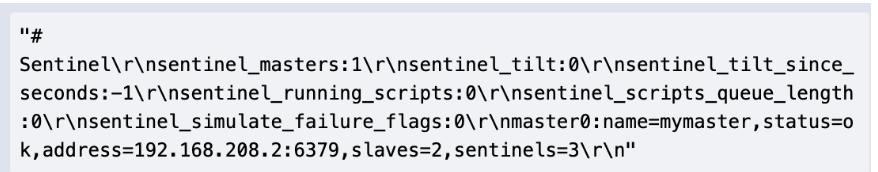
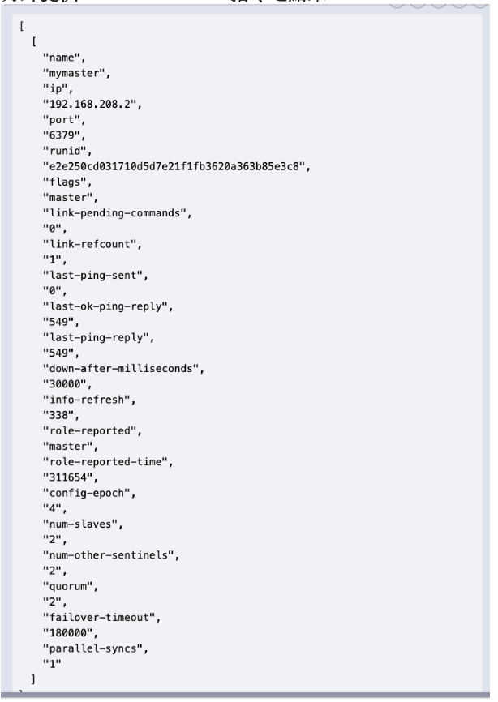

近期工作專案上，接觸並且在系統架構之中使用到 Redis ，剛好我需要負責將測試環境之 Redis 哨兵模式架起以及相關設定、與專案程式整合...等。
趁這個機會將筆記記錄到此，方便以後查看。


Image Source : [Redis Article](https://kinsta.com/docs/redis-cache/).

<!--truncate-->


## 前言
Redis 是個 in-memory 的資料存儲系統，有低延遲、回應時間快等特性。很適合作為比如 Cache 的應用。詳細 Redis 的介紹，因為不是本篇著重之地方，就不贅述。可參考 [Redis 官網](https://redis.io/) 

## Sentinel 架構

在說明 Sentinel (哨兵模式) 之前，我們先來說說 Redis 的 Master Slave (主從模式)。

主從模式會將 Redis 節點分為 Master 以及 Slave 節點。 所有寫入只能夠交給 Master 進行，將讀寫分離。 Slave 則只能夠負責讀取資料。 

  

而哨兵模式則是在 Master-Slave 架構上之延伸。除了原本 Master-Salve 之節點以外，還多了 Sentinel 節點去負責監控 Master、自動失效處理...等，提升系統的高可用性。

當 Master 結點不論是真的失效了或者可能是暫時的網路不穩而被哨兵們懷疑失效了，哨兵們就會透過共識機制判定是否真的失效。如果真的失效，會再透過選舉的方式將原本某個 Slave 節點推舉為新的 Master 節點。

而原本之 Master 節點如果後來恢復運行，就會以 Slave 的身份繼續進行。



## 本機環境架設

接下來使用本機嘗試架設起 Redis Sentinel 來玩玩。
我們總共將會架起 1 Master + 2 Slave 為我們的主從模式之 Redis 節點。並在這個之上架設 3 Sentinel 節點。

1. 將所有 Sentinel, Master, Slave 節點都安裝在本機上
	

	1. 在自己機器上，安裝 Redis 。 我自己是 Mac ，所以透過 Brew 指定將 Redis 安裝到我本機上。
	2. Redis 節點之 Config 檔案請參考  
		* [Redis-Master](./sentinel/instancesAtLocalHost/conf/redis-1.conf)
		* [Redis-Slave1](./sentinel/instancesAtLocalHost/conf/redis-2.conf)
		* [Redis-Slave2](./sentinel/instancesAtLocalHost/conf/redis-3.conf)
		* [Redis-Sentinel1](./sentinel/instancesAtLocalHost/conf/redis-sentinel-1.conf)
		* [Redis-Sentinel2](./sentinel/instancesAtLocalHost/conf/redis-sentinel-2.conf)
		* [Redis-Sentinel3](./sentinel/instancesAtLocalHost/conf/redis-sentinel-3.conf)
	3.  使用 ReadMe 檔案中提供之指令
		[View README](./sentinel/instancesAtLocalHost/readme.txt)

2. 因為在本機一個一個節點啟動太麻煩，所以後來都選擇使用 Docker Compose 之方式，一次將所有需要之節點啟動。
   
	* [Docker Compose File](./sentinel/instancesAtDocker/docker-compose.yml)
    * [Redis-Master](./sentinel/instancesAtDocker/redis/redis-1.conf)
	* [Redis-Slave1](./sentinel/instancesAtDocker/redis/redis-2.conf)
	* [Redis-Slave2](./sentinel/instancesAtDocker/redis/redis-3.conf)
	* [Redis-Sentinel1](./sentinel/instancesAtDocker/sentinel/redis-sentinel-1.conf)
	* [Redis-Sentinel2](./sentinel/instancesAtDocker/sentinel/redis-sentinel-2.conf)
	* [Redis-Sentinel3](./sentinel/instancesAtDocker/sentinel/redis-sentinel-3.conf)

不論使用什麼方式啟動，在啟動之後可透過 Redis-cli 的方式檢驗架設狀況。  
 
於任一 Sentinel 節點上執行指令 INFO SENTINEL，如果架設沒有問題，應該會看到類似如下之資訊。  
重點在於，最後面 sentinels=3 之數字應該要為 3，有時候安裝上如果有問題，這個數字就不會是 3。要多加注意。

  

於任一 Sentinel 節點上執行指令 SENTINEL masters。如果架設沒有問題，應該會看到 num-salves = 2 以及 num-other-sentinels = 2 。

  


## SpringBoot 與 Redis 以及 Redis Sentinel 整合

直接使用[Spring-data-redis](https://docs.spring.io/spring-data/data-redis/docs/current/reference/html/)。 使用上非常方便，我們只需要照著 Spring 的文件在  Maven 引入後，很快就可以將 Spring Application 跑起來。

重點是在於配置 JedisConnectionFactory Bean 的時候，我們需要去配置 Sentinel 的 RedisSentinelConfiguration 來提供給 JedisConnectionFactory 做使用。

```
	JedisConnectionFactory jedisSentinelConnectionFactory(RedisProperties redisProperties,
    JedisClientConfiguration clientConfig) {

        String master = redisProperties.getSentinel().getMaster();
        Set<String> sentinelNodes = Set.copyOf(redisProperties.getSentinel().getNodes());

        RedisSentinelConfiguration sentinelConfig = new RedisSentinelConfiguration(master, sentinelNodes);
        return new JedisConnectionFactory(sentinelConfig, clientConfig);
    }
```

因為 Spring-data-redis 裏面之 RedisProperties 已將所有會用到之設定都定義好，我們只需要將需要用到之如 Sentinel 相關資訊在 SpringBoot 中的 yaml 或者 properties 檔加上即可。


### 參考文章
1. [Redis (六) - 主從複製、哨兵與叢集模式](https://hackmd.io/@tienyulin/redis-master-slave-replication-sentinel-cluster)  