# Vs code SonarLint 安裝並設定

- [SonarLint簡介](#sonarLint_intro)
  
- [IDE上安裝SonarLint](#installOnIDE)
  
- [啟動一個SonarQube server](#createSonarQubeServer)

- [使用自訂規則](#use_Own_rules)

- [使SonarLint能夠及時透過Vs code告訴我們程式碼狀況](#instantly_Scan)


<div id='sonarLint_intro'/> 

### SonarLint簡介 
---
[SonarLint][sonarLint]可讓我們在編寫程式碼的時候，即時獲得[SonarQube][sonarqube_official_webSite]回饋(bug, code smell, rules).提升程式品質，並且可以導入到開發團隊中，定好開發規範後，使得各成員開發出的程式被確保在規範底下，提升團隊程式碼統一風格...等好處。

> **⚠️** 注意
> 
> SonarLint in VS Code supports analysis of JavaScript, TypeScript, Python, Java, HTML & PHP code only.   
   
<div id='installOnIDE'/> 

### IDE上安裝SonarLint
---
1. Vs code -> market place 下載 SonarLint
   
   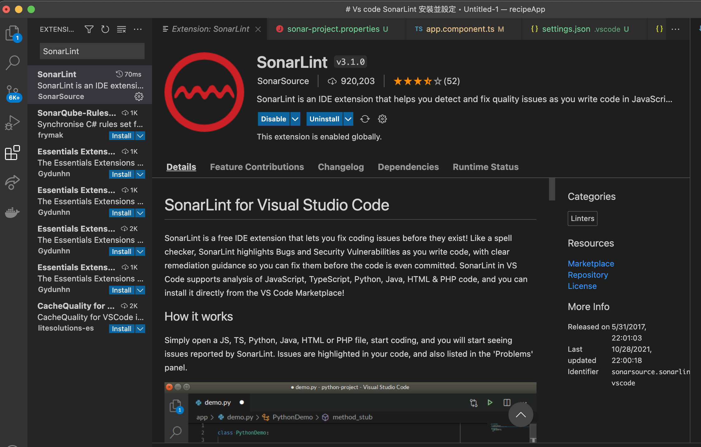   
2. 完成後，在Vs code -> Explorer下方可看到 *SONARLINT RULES*   

    > 📘 Hint   
    > 這些*RULES*為當我們還未為專案設定連結對應到SonarQube/SonarCloud server上的專案之前，SonarLint會自動使用這邊顯示的Rules檢查專案程式碼。可依照個人喜好開啟或關閉每一個Rule.

    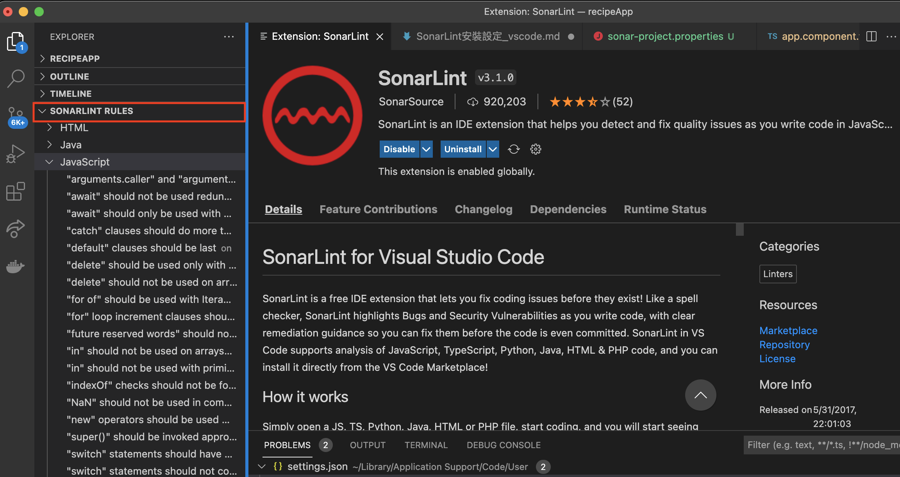   
3. 這時即可以在專案內看到SonarLint為不符合規則之程式碼加上波浪底線提示我們

   a. 這邊先在Local將TypeScript其中一條規則啟用。   
   `"===" and "!==" should be used instead of "==" and "!=" (typescript:S1440)`

   b. 如可以從程式裡面看到如畫面的樣子，那就代表安裝成功。
      1. 在程式碼底下，會出現波浪號。將滑鼠移到上面會出現SonarLint提示。
      2. 下方Problem頁面裡也會顯示目前SonarLint偵測到的所有錯誤，並且會依照檔案區分。
      3. 在提示選擇Show Problem後會開啟細節描述以及提供建議修改方向。  
    <br />
    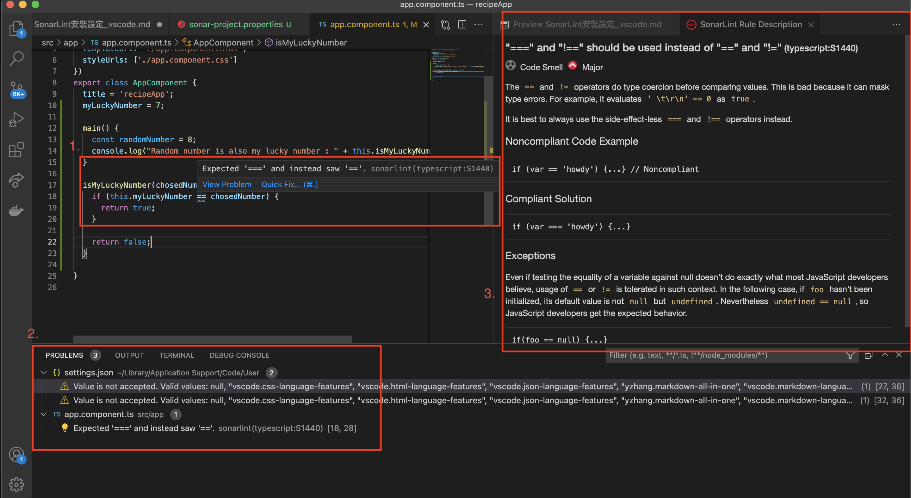   

<br/>  

<div id='createSonarQubeServer'/> 

### 啟動一個SonarQube server
---
1. 接著啟動一個SonarQube Server, 下載方式有兩種。

    a. 使用zip檔案下載安裝   
    
    -> 可參考[連結][SonarQube install link]。並先確認[安裝環境需求][SonarQube_Install_PreRequirements]。   

    b. 使用Docker Image下載   
    -> 可參考[連結][SonarQube install link], Installing SonarQube from the Docker Image的部分。

2. 啟動Server，登入並進入主畫面。
   
   Default URL: http://localhost:9000     
   Default Account and Password : admin/admin

   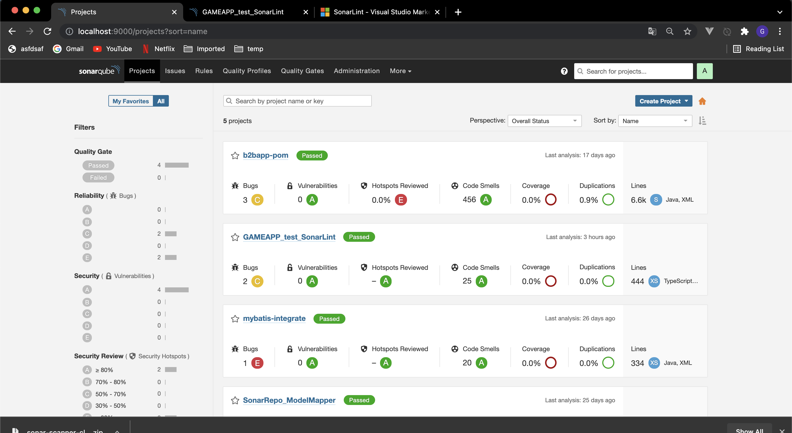   

3. 創建Token，稍後設定專案連結SonarQube上專案時會用到。讓我們的帳號資訊不需暴露在專案檔案裡面。

    右上角 Administrator -> My Account -> Security -> Generate Tokens  
    
    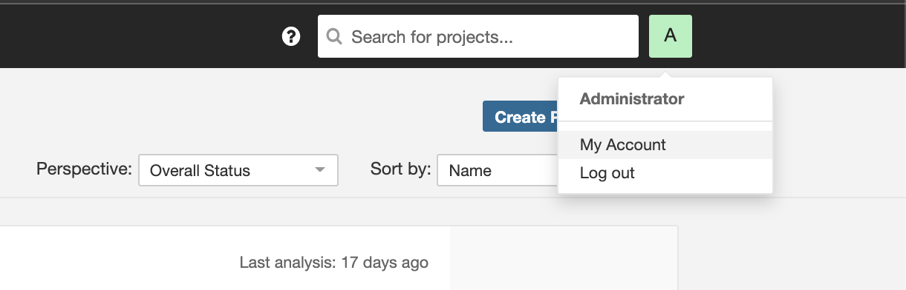<br/>     

    將 <span id="getToken">**產生之Token**</span> 記錄起來。

    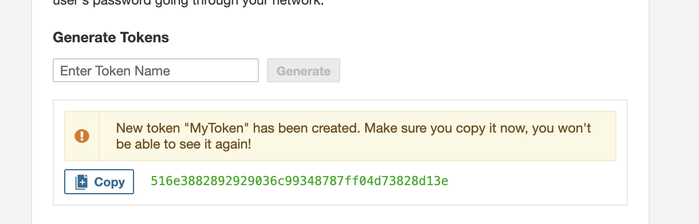<br/>   

4. 創建Project

    左上角Projects -> 右上角 *CREATE PROJECT* -> Manually -> 輸入Project name & key -> 如果需要整合CI/CD可在這邊加入，不然就選擇 *Locally* -> Use existing token 輸入上一步驟獲得之[TOKEN](#getToken) -> 選擇Other(forJs...) -> 選擇OS

5. 執行Sonar Scanner 
   
    不論哪種皆可參考 [SonarScanner設定下載頁面][sonarScanner],其中有一步驟不可少。 在專案根目錄底下加入名為 *sonar-project.properties*檔案，並且在其中設定相關設定值。

    ```properties
    # 指定Project Key，創建SonarQube Project時輸入得值
    sonar.projectKey=sonarLint_DockerScanner_recipeApp

    # 我自己SOnarQube 和 Sonar Scanner都以Docker image啟動container，需要配置 sonar.host.url(預設為http://localhost:9000)
    # 這邊自己在測試的時候，將兩個container加入到同個network底下，但無法使用sonarQube server contianer當作ip name成功執行Sonar Scanner。 因此先使用Container IP。
    sonar.host.url=http://172.18.0.2:9000
    ```

    a. 下載ZIP
        在上一步驟選擇完OS後，下方SonarQube會跳出如下圖畫面提供要執行之command line指令。   
            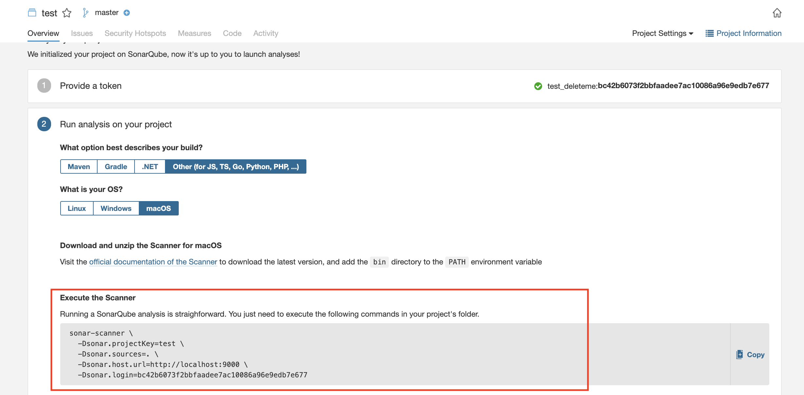   

    b. 使用Docker Image，可參考[SonarScanner設定下載頁面][sonarScanner]之docker run command。
        
    ```docker
    # 如果SonarQube以及Sonar Scanner都使用Docker container執行
    # 記得加上 --network 
    docker run \
        --rm \
        -e SONAR_HOST_URL="http://${SONARQUBE_URL}" \
        -e SONAR_LOGIN="myAuthenticationToken" \
        -v "${YOUR_REPO}:/usr/src" \
        sonarsource/sonar-scanner-cli
    ```

6. 成功後，頁面會自動刷新並顯示結果。

    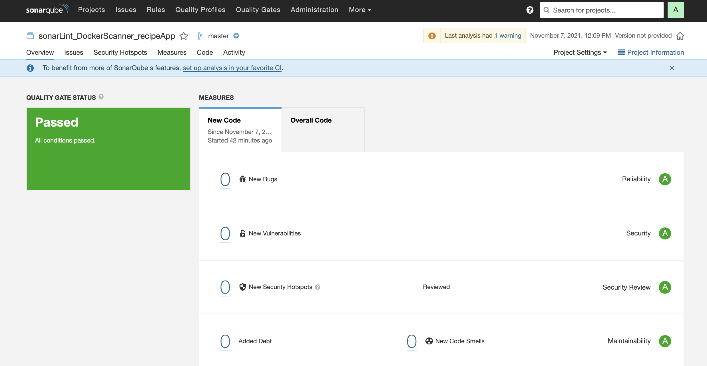   
   
<div id='use_Own_rules'/> 

### 使用自訂規則
---
每一個專案預設皆是使用SonarQube上提供之規則，我們可以依照團隊或者個人需求自行決定要新增或刪除或者甚至自訂規則。(底下以TypeScript為例)

1. Qualuty Profiles -> TypeScript區塊 -> 對目前Sonar自帶的profile選擇設定按鈕 -> Copy -> 為這個複製的profile命名

2. 命名後會帶入到規則明細頁面 -> 點選Activate more

    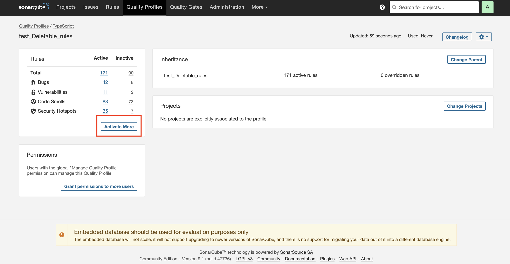   
3. 啟用自己想要專案啟用之規則(以"===" and "!==" should be used instead of "==" and "!="為例)
   
   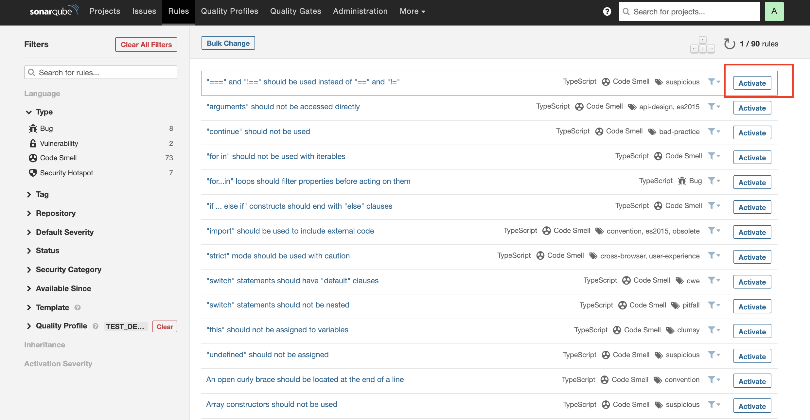  

<div id='instantly_Scan'/> 

### 使SonarLint能夠及時透過Vs code告訴我們程式碼狀況
---

> ℹ️ 提示
>
> a. 在綁定Vs code SonarLint與SonarQube上專案之前，可先把剛剛設定成activate的local rule重新設定成deactivate, 方便查看效果確認是否連結成功。 

根據文件說法，每次改動Server上設定，可使用 `SonarLint: Update all project bindings to SonarQube/SonarCloud` 更新local storage讓改動生效。
> SonarLint keeps server side data in a local storage. If you change something on the server such as the quality profile, you can trigger an update of the local storage using the "SonarLint: Update all project bindings to SonarQube/SonarCloud" command on the command palette。 


1. 點選Vs code左上角*Code* -> *Preferences* -> *Settings* -> *Extensions* -> *SonarLint*

    設定Vs code上SonarLint的相關設定，點選 *Edit in settings.json*

    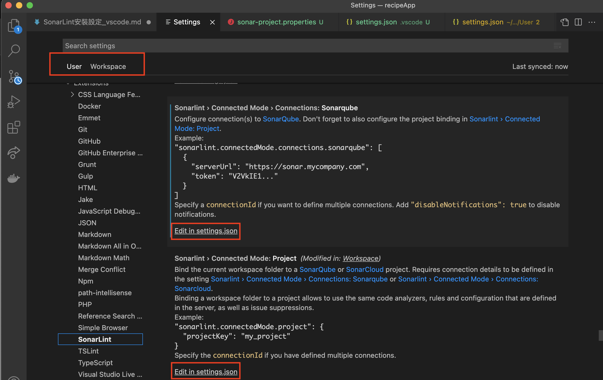  

    <br/>   
2. 在User層級的Settings.json裡加入設定SonarQube host以及token。

    ```properties
    "sonarlint.connectedMode.connections.sonarqube": [
        {
            "serverUrl": "${YOUR_SONARQUBE_SERVER_URL}",
            "token": "${YOUR_TOKEN}"
        }
    ]
    ```

3. 在WorkSpace層級之Settings.json為目前WorkSpace打開之專案設定對應之SonarQube專案的Project Key.

    ```properties
    {
    "sonarlint.connectedMode.project": {
        "projectKey": "SonarLint_DockerScanner_recipeAPP"
    }
    ```

4. 叫出Vs code的Command Palette 

    Windows: `Ctrl+Shift+P `  
    Mac: `CMD+Shift+P`

    輸入SonarLint選擇 *SonarLint: Update all project bindings to SonarQube/SonarCloud*

    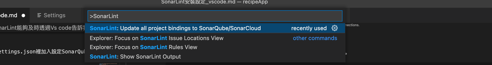 <br/> 

    如果設定無誤，這時候Vs code應該會跳出Update成功畫面

    <br/>

    這時候查看程式碼，應會就會有如打開local rule的效果了。
     
    
    

[sonarqube_official_webSite]: https://www.sonarqube.org/downloads/?gads_campaign=Asia-SonarQube&gads_ad_group=SonarQube&gads_keyword=sonarqube&gclid=CjwKCAjwz5iMBhAEEiwAMEAwGKjWWntLZubiv1FlCYcbZ97hnkuWg6uh36bQMvmIY6GfgcwVosKyKRoCPIQQAvD_BwE "SonarQube official web site"

[SonarQube_Install_PreRequirements]: https://docs.sonarqube.org/latest/requirements/requirements/ "SonarQube pre requirements documents" 

[SonarQube install link]: https://docs.sonarqube.org/latest/setup/install-server/ "SonarQube installation link"

[sonarLint]: https://marketplace.visualstudio.com/items?itemName=SonarSource.sonarlint-vscode "SonarLint visual studio settings officail documents"

[sonarScanner]: https://docs.sonarqube.org/latest/analysis/scan/sonarscanner/ "Sonar Scanner downloads"