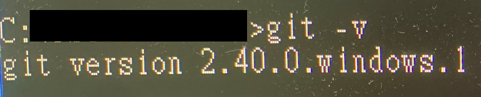
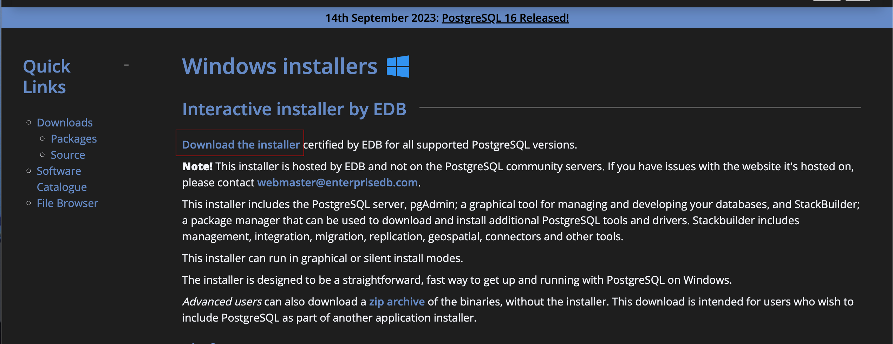
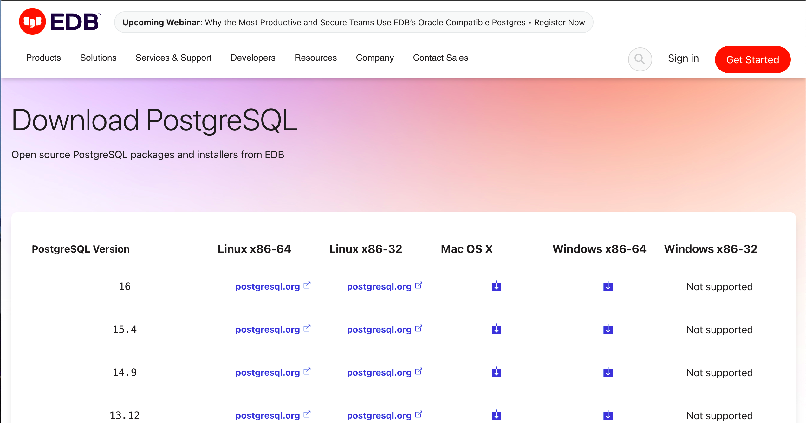

簡單記錄一下，自己在 Windows 上，安裝 PostgreSql + Gitea 之筆記。 


Image Source : [PostgreSql](https://www.google.com/imgres?imgurl=https%3A%2F%2Fimages.g2crowd.com%2Fuploads%2Fproduct%2Fimage%2Flarge_detail%2Flarge_detail_251be2af3ae607c45c14e816eaa1cf41%2Fpostgresql.png&tbnid=9zren5CQ2BxgKM&vet=12ahUKEwjUnarnjruBAxWLBogKHYWlBA8QMygEegQIARB9..i&imgrefurl=https%3A%2F%2Fwww.g2.com%2Fproducts%2Fpostgresql%2Freviews&docid=WJL1Vla7vnpEBM&w=328&h=364&q=postgresql%20&ved=2ahUKEwjUnarnjruBAxWLBogKHYWlBA8QMygEegQIARB9), [Gitea](https://www.google.com/imgres?imgurl=https%3A%2F%2Fexternal-preview.redd.it%2F-zBUXUei5mNWHzOdVs9C7pYZfJuKBABYdqX7GjgJ2cI.jpg%3Fwidth%3D640%26crop%3Dsmart%26auto%3Dwebp%26s%3D728c27431f8ed2c8e0f7b03620b29e55767f7dfe&tbnid=rpOBs7lvTCXbaM&vet=12ahUKEwit4ITUjruBAxVWbN4KHa3CCfcQMygKegQIARBn..i&imgrefurl=https%3A%2F%2Fwww.reddit.com%2Fr%2FGitea%2F&docid=bD-c3RlxHjj2qM&w=640&h=640&q=postgresql%20gitea&ved=2ahUKEwit4ITUjruBAxVWbN4KHa3CCfcQMygKegQIARBn)

<!--truncate-->

## 安裝 Git 

  1. 如已經安裝過 Git 於機器上，可跳過此步驟
  2. 至 [Github 上 Windows Git 下載連結](https://github.com/git-for-windows/git/releases) 選擇版本安裝。
  3. Git 這部分的安裝檔基本上不需要我們改變什麼設定，一直無腦地點下一步直到安裝完成即可。
  4. 安裝完後，開啟 CMD 以下面指令檢查 Git 版本以及是否有安裝完成。  
    ```
    git -v
    ```  
    如果成功，應該可以看到類似以下之畫面 (忽略我螢幕很髒 XD)
     

## 安裝 PostgreSQL

1. 至 [PostgreSql 官網之 Windows 下載連結](https://www.postgresql.org/download/windows/) 選擇 Download the Installer.   
    
2. 將會導至如下頁面，依照自己要安裝之版本，選擇對應檔案下載。
    
3. 如果不想下載安裝檔，也可直接下載 Binary 檔案之 ZIP 檔案。 [下載連結](https://www.enterprisedb.com/download-postgresql-binaries)  
    - 下載完 ZIP 檔後，將 ZIP 檔解壓縮至目標路徑。
    - 解壓縮後所有檔案將會位於名為「pgsql」之資料夾底下。
    - 於 pgsql 資料夾底下，自行創建名為「data」之資料夾。
4. 將 pgsql 底下 /bin 之路徑，加入系統之 PATH 環境變數。
5. 於 /bin 之路徑底下執行指令，初始 PostgreSQL DB。 (postgres 為預設之 UserName)
    ```
   initdb -D path/to/your/data/folder -U postgres -E utf8
   ```
6. 於 /bin 之路徑底下執行指令，啟動 DB。 (-l 指令 DB log 要寫入哪個檔案)
    ```
   pg_ctl -D path/to/your/data/folder -U postgres -l logfile start
   ```
7. 於 /bin 之路徑底下執行指令，透過 psql 連線至 DB 。
    ```
   psql -U postgres
   ```
8. 使用以下指令創建名為 gitea 之 ROLE
    ```
   CREATE ROLE gitea WITH LOGIN PASSWORD 'gitea';
   ```
9. 使用以下指令創建名為 giteadb 之 Database, 並且將 Owner 設定為 gitea 
    ```
   CREATE DATABASE giteadb WITH OWNER gitea TEMPLATE template0 ENCODING UTF8 LC_COLLATE 'en_US.UTF-8' LC_CTYPE 'en_US.UTF-8';
   ```
10. 可透過自己習慣之 DB 工具連線至 postgreSQL 或者至 pgsql/pgAdmin4/runtime 底下執行 pgAdmin4.exe 啟動大象。


- (未試過) 將 PostgreSQL 註冊為 Windows 服務，並在 Windows 啟動時，自動啟動。
    ```
  pg_ctl register -D path/to/your/data/folder -N serviceName -U gitea -P gitea -S auto 
  ```

## 安裝 Gitea

1. 至 [Gitea 官網](https://docs.gitea.com/installation/install-from-binary) 按照指示進行下載。
2. 將執行檔複製至希望 Gitea 使用之路徑，並將執行檔案名稱修改為 gitea.exe。
3. 於 CMD 中，執行此執行檔。將會在 CMD 中顯示 Gitea 之 host & port 。
4. 透過瀏覽器訪問 Gitea 介面，並且將所需要之資訊設定後，按下安裝。

- (未試過) 將 Gitea 註冊為 Windows 服務，並在 Windows 啟動時，自動啟動。 參考 [Gitea 說明](https://docs.gitea.com/installation/windows-service)。
- (未試過) 修改 Gitea 預設 Port (預設為 3000)。 參考 [Gitea 說明]((未試過) 將 Gitea 註冊為 Windows 服務，並在 Windows 啟動時，自動啟動。 參考 [Gitea 說明](https://docs.gitea.com/installation/windows-service)。)。

## 參考文章
1. [How to Create a User in PostgreSQL](https://www.commandprompt.com/education/how-to-create-a-user-in-postgresql/)  
2. [PostgreSql pg_ctl](https://www.postgresql.org/docs/current/app-pg-ctl.html)
3. [Gitea Official Doc](https://docs.gitea.com/)
